# Introduction

Alternative Payment Providers (APPs)—including payment aggregators, QR-code networks, and mobile wallet ecosystems—handle substantial transaction volumes in South and Southeast Asia (e.g., India, Pakistan, Bangladesh, Vietnam, Cambodia). Due to their structural separation from legacy clearinghouses, these entities lack specialized international standards (ISO) or rigid frameworks (PCI-DSS) tailored to their operational risks.

The primary operational vulnerability is time-delayed fraud ("hit-and-run" exploits). In these scenarios, a customer authorizes a payment, the APP receives a temporary confirmation or clearing registry, and immediately credits the merchant. Days later, the clearing bank issues a chargeback due to card theft or friendly fraud. If the merchant has already withdrawn the funds, the APP incurs a capital loss.

This document outlines a standardized, extraterritorial approach to mitigate this risk by establishing a Self-Regulated Organization (SRO) backed by an automated, blockchain-hosted compensation pool. This protocol eliminates capital stagnation caused by fixed rolling reserves while providing immutable mathematical guarantees to financial regulators. 

To ensure absolute resilience and eliminate any Single Point of Failure (SPOF), the underlying governance of the protocol completely rejects single-administrator control vectors. The operational and emergency management layers are hardcoded into an autonomous M-of-N consensus matrix distributed cryptographically among the National Embassy Nodes, guaranteeing system survivability and continuous recovery even in the event of partial cryptographic key compromise.


# Terminology

The key words "MUST", "MUST NOT", "REQUIRED", "SHALL", "SHALL NOT", "SHOULD", "SHOULD NOT", "RECOMMENDED", "NOT RECOMMENDED", "MAY", and "OPTIONAL" in this document are to be interpreted as described in BCP 14 [RFC2119] [RFC8174] when, and only when, they appear in all capitals, as shown here.

* Alternative Payment Provider (APP): A non-bank financial intermediary aggregating local payment methods.
* DeMI SRO: Decentralized Mutual Insurance Self-Regulated Organization.
* Embassy Node: A regional server infrastructure combining an Ethereum L1 full node, validator client, and private RPC gateway.
* Epoch Batch: A packed cryptographic structure containing a fixed interval of localized transaction states.
* Base Fee & Priority Fee: Ethereum gas mechanics as defined in EIP-1559.

# Protocol Mechanics and Smart Contract Architecture

The DeMI protocol shifts the risk management layer from private, auditable Web2 databases to an autonomous, public smart contract acting as a decentralized escrow and risk underwriter.

## Transaction Batching Pipeline

To minimize Ethereum L1 gas expenditures, APPs MUST NOT execute on-chain transactions for individual payment actions.

1. The local APP payment engine logs transactions in real-time.
2. Every 10 minutes (the standard Epoch interval), the APP compiles all transaction metadata into a Merkle Tree.
3. The root hash of the Merkle Tree, along with total volume and net risk metrics, is packaged into an on-chain batch submission.

## Dynamic Algorithmic Underwriting

The DeMI contract maintains an on-chain ledger of merchant risk coefficients. Instead of static 10% rolling reserves, the contract dynamically evaluates the required fee contribution based on the formula:

Contribution Rate = Base_Rate * (1 + (Chargebacks / Total_Volume))

If a merchant's historical fraud rate spikes, the smart contract automatically increases their on-chain collateral requirement for subsequent epochs.

## Core Solidity Implementation Reference

The compensation pool and risk management ledger MUST implement a decentralized, multi-governor smart contract architecture that rejects centralized ownership. Administrative functions—such as regional node authorization and emergency fund restoration—MUST require an on-chain M-of-N threshold consensus executed directly by the authenticated governance entities. 

The smart contract MUST include a built-in automated social recovery pipeline, allowing surviving regional Embassy Nodes to unilaterally trigger an emergency system rescue and bypass compromised nodes or founders via transparent on-chain voting.

The core implementation MUST comply with the following architectural specification:

```solidity
// SPDX-License-Identifier: MIT
pragma solidity ^0.8.24;

interface IERC20 {
    function transferFrom(address from, address to, uint256 amount) external returns (bool);
    function transfer(address to, uint256 amount) external returns (bool);
    function balanceOf(address account) external view returns (uint256);
    function allowance(address owner, address spender) external view returns (uint256);
}

/**
 * @title DeMISROConsensusPool
 * @author Evgeny A. Shubralov (DeMI-SRO Consortium)
 * @notice Core smart contract for the decentralized SRO compensation pool.
 * Architecture eliminates single points of failure via M-of-N consensus.
 */
contract DeMISROConsensusPool {
    
    struct MerchantProfile {
        uint256 totalVolume;
        uint256 totalChargebacks;
        uint256 activeRiskTier; 
        uint256 dynamicRate;     
        uint256 totalContributed;
        uint256 claimsPaidThisYear;
    }

    struct EmergencyProposal {
        bytes32 targetMerchantId;
        uint256 voteCount;
        uint256 timestamp;
        bool executed;
        mapping(address => bool) hasVoted;
    }

    uint256 public constant BASE_RATE = 30;         
    uint256 public constant MAX_CLAIM_LIMIT = 500 * 10**6; 
    uint256 public constant SYSTEM_STOP_LOSS_PCT = 40;     

    IERC20 public immutable settlementToken;       
    uint256 public totalPoolReserves;              
    uint256 public monthlyClaimsPaid;             
    uint256 public lastResetTimestamp;             
    bool public isSystemFrozen;                    

    address[] public sroGovernors;
    mapping(address => bool) public isGovernor;
    uint256 public immutable requiredConsensusThreshold; 

    mapping(address => bool) public authorizedEmbassies;
    mapping(bytes32 => MerchantProfile) public merchants;
    mapping(bytes32 => bool) public processedBatches;
    
    mapping(uint256 => EmergencyProposal) public emergencyProposals;
    uint256 public proposalCounter;

    event EmbassyAuthorized(address indexed embassy, bool status);
    event BatchProcessed(bytes32 indexed merchantId, bytes32 indexed batchRoot, uint256 contribution);
    event ClaimSettled(bytes32 indexed merchantId, uint256 amount, address indexed recipient);
    event ValidatorRebateReceived(address indexed validator, uint256 amount);
    event SystemEmergencyTriggered(string reason);
    event SystemConsensusResumed(uint256 indexed proposalId, uint256 totalVotes);
    event ProposalInitiated(uint256 indexed proposalId, bytes32 indexed merchantId);

    modifier onlyGovernor() {
        require(isGovernor[msg.sender], "Auth: Caller is not an authorized SRO Governor");
        _;
    }

    modifier onlyAuthorizedNode() {
        require(authorizedEmbassies[msg.sender] || isGovernor[msg.sender], "Auth: Node unauthorized");
        _;
    }

    modifier whenNotFrozen() {
        require(!isSystemFrozen, "Emergency: Pool is frozen due to Stop-Loss breach");
        _;
    }

    constructor(address _settlementToken, address[] memory _initialGovernors, uint256 _threshold) {
        require(_settlementToken != address(0), "Config: Invalid token address");
        require(_initialGovernors.length >= _threshold, "Config: Threshold exceeds governors count");
        require(_threshold > 0, "Config: Invalid threshold");

        settlementToken = IERC20(_settlementToken);
        requiredConsensusThreshold = _threshold;
        lastResetTimestamp = block.timestamp;

        for (uint256 i = 0; i < _initialGovernors.length; i++) {
            address gov = _initialGovernors[i];
            require(gov != address(0), "Config: Invalid governor address");
            require(!isGovernor[gov], "Config: Duplicate governor");
            
            isGovernor[gov] = true;
            sroGovernors.push(gov);
        }
    }

    function setEmbassyAuthorization(address _embassy, bool _status) external onlyGovernor {
        require(_embassy != address(0), "Config: Invalid embassy address");
        authorizedEmbassies[_embassy] = _status;
        emit EmbassyAuthorized(_embassy, _status);
    }

    function initiateConsensusRescue(bytes32 _targetMerchantId) external onlyAuthorizedNode returns (uint256) {
        require(isSystemFrozen, "Recovery: System is running in normal mode");
        
        proposalCounter++;
        EmergencyProposal storage p = emergencyProposals[proposalCounter];
        p.targetMerchantId = _targetMerchantId;
        p.voteCount = 1;
        p.timestamp = block.timestamp;
        p.hasVoted[msg.sender] = true;

        emit ProposalInitiated(proposalCounter, _targetMerchantId);
        return proposalCounter;
    }

    function voteForConsensusRescue(uint256 _proposalId) external onlyAuthorizedNode {
        require(isSystemFrozen, "Recovery: System is not frozen");
        EmergencyProposal storage p = emergencyProposals[_proposalId];
        require(!p.executed, "Recovery: Proposal already executed");
        require(!p.hasVoted[msg.sender], "Recovery: Duplicate vote from this node");
        require(block.timestamp <= p.timestamp + 7 days, "Recovery: Proposal expired");

        p.hasVoted[msg.sender] = true;
        p.voteCount++;

        if (p.voteCount >= requiredConsensusThreshold) {
            p.executed = true;
            isSystemFrozen = false;
            monthlyClaimsPaid = 0;
            lastResetTimestamp = block.timestamp;
            
            emit SystemConsensusResumed(_proposalId, p.voteCount);
        }
    }

    function processEpochBatch(
        bytes32 _merchantId,
        bytes32 _batchRoot,
        uint256 _epochVolume,
        uint256 _epochChargebacks
    ) external onlyAuthorizedNode whenNotFrozen {
        require(!processedBatches[_batchRoot], "Pool: Batch Merkle Root already processed");
        require(_merchantId != bytes32(0), "Pool: Invalid merchant ID");

        MerchantProfile storage merchant = merchants[_merchantId];
        merchant.totalVolume += _epochVolume;
        merchant.totalChargebacks += _epochChargebacks;

        if (merchant.totalVolume > 0) {
            uint256 fraudRatio = (merchant.totalChargebacks * 10000) / merchant.totalVolume;
            if (fraudRatio > 100) {       
                merchant.activeRiskTier = 3;
                merchant.dynamicRate = BASE_RATE * 3; 
            } else if (fraudRatio > 20) {  
                merchant.activeRiskTier = 2;
                merchant.dynamicRate = BASE_RATE * 2; 
            } else {
                merchant.activeRiskTier = 1;
                merchant.dynamicRate = BASE_RATE;     
            }
        } else {
            merchant.dynamicRate = BASE_RATE;
        }

        uint256 contributionAmount = (_epochVolume * merchant.dynamicRate) / 10000;
        processedBatches[_batchRoot] = true;

        if (contributionAmount > 0) {
            uint256 currentAllowance = settlementToken.allowance(msg.sender, address(this));
            require(currentAllowance >= contributionAmount, "Pool: Insufficient ERC20 allowance");

            merchant.totalContributed += contributionAmount;
            totalPoolReserves += contributionAmount;

            require(settlementToken.transferFrom(msg.sender, address(this), contributionAmount), "Pool: Transfer failed");
        }

        emit BatchProcessed(_merchantId, _batchRoot, contributionAmount);
    }

    function claimCompensation(
        bytes32 _merchantId, 
        uint256 _claimAmount, 
        address _recipient
    ) external onlyAuthorizedNode whenNotFrozen {
        require(_claimAmount <= MAX_CLAIM_LIMIT, "RiskCap: Exceeds Maximum Claim Limit ($500)");
        require(_recipient != address(0), "Pool: Invalid recipient wallet");

        if (block.timestamp >= lastResetTimestamp + 30 days) {
            monthlyClaimsPaid = 0;
            lastResetTimestamp = block.timestamp;
        }

        MerchantProfile storage merchant = merchants[_merchantId];

        uint256 merchantYearlyLimit = merchant.totalContributed * 2;
        require(merchant.claimsPaidThisYear + _claimAmount <= merchantYearlyLimit, "RiskCap: Exceeds annual aggregate limit");

        uint256 dynamicStopLossTrigger = (totalPoolReserves * SYSTEM_STOP_LOSS_PCT) / 100;
        if (monthlyClaimsPaid + _claimAmount > dynamicStopLossTrigger) {
            isSystemFrozen = true;
            emit SystemEmergencyTriggered("System Stop-Loss breached. Structural fraud attack suspected.");
            revert("Emergency: System stop-loss activated. Payout blocked.");
        }

        merchant.claimsPaidThisYear += _claimAmount;
        monthlyClaimsPaid += _claimAmount;
        
        require(totalPoolReserves >= _claimAmount, "Pool: Insufficient reserves");
        totalPoolReserves -= _claimAmount;

        require(settlementToken.transfer(_recipient, _claimAmount), "Pool: Payout failed");
        emit ClaimSettled(_merchantId, _claimAmount, _recipient);
    }

    function depositValidatorRebate(uint256 _amount) external whenNotFrozen {
        require(_amount > 0, "Pool: Rebate must be > 0");
        totalPoolReserves += _amount;
        require(settlementToken.transferFrom(msg.sender, address(this), _amount), "Pool: Rebate transfer failed");
        emit ValidatorRebateReceived(msg.sender, _amount);
    }
}
```

## Regional Resiliency and Network Topology
To guarantee zero-trust operations across jurisdictions with volatile internet backbones, the infrastructure MUST separate on-chain block execution from public-facing internet routing.

## Regional "Embassy Node" Topology
Each participating country (India, Pakistan, Bangladesh, Vietnam, Cambodia) SHALL host an autonomous, isolated data center stack ("Embassy Node"). Each node consists of an Ethereum execution client (e.g., Geth or Nethermind), a consensus client (e.g., Lighthouse), and a secure regional API gate.

## Isolated MPLS and Satellite Network Mesh
All peer-to-peer (P2P) traffic dedicated to node replication, synchronization, and local RPC query forwarding MUST be encapsulated within a private Multi-Protocol Label Switching (MPLS) VPN network mesh.
To protect against physical cable severing or local state-level network censorship, every Embassy Node MUST deploy a secondary satellite uplink (e.g., Low Earth Orbit satellite terminal). The edge router MUST automatically failover to the satellite channel within 500 milliseconds if the primary MPLS connection is dropped.

## Capacity-Aware Round-Robin Load Balancing
Regional applications interact with nodes via local private RPC endpoints. Traffic load balancing across international node boundaries MUST use a Weighted Round-Robin (WRR) algorithm. The weights MUST dynamically adjust based on real-time node resource telemetry (CPU load, network throughput, and mTLS connection latency). If Node A (e.g., Bangladesh) experiences hardware saturation, traffic MUST be progressively offloaded to Node B (e.g., India) proportionate to Node B's remaining system capacity.

# API Specifications
Embassy Nodes MUST expose a standardized, authenticated REST API for Web2 payment processing engines. All endpoints MUST require authentication via TLS client certificates (mTLS).

## POST /api/v1/epoch/submit
Invoked by the APP backend at the end of each 10-minute epoch.

## Request Format
json 
{ 
"merchant_id": "0x7465737400000000000000000000000000000000000000000000000000000000", 
"epoch_id": 10842, 
"batch_root": "0x3a4f8e...b2c1", 
"metrics": 
{ 
"total_volume_usd": 154250.00, 
"total_chargebacks_usd": 420.00, 
"transaction_count": 3120 
} 
} 

## Response Format
json 
{ 
"status": "QUEUED", 
"batch_root": "0x3a4f8e...b2c1", 
"calculated_premium_usd": 462.75, 
"risk_tier": 2, 
"estimated_gas_eth": "0.0042" 
} 

### POST /api/v1/claims/request
Invoked to pull settlement funds when a time-delayed clearing chargeback is validated.

## Request Format
json 
{ 
"merchant_id": "0x7465737400000000000000000000000000000000000000000000000000000000", 
"claim_id": "99214-X", 
"amount_usd": 350.00, 
"evidence_hash": "0x88f2...99aa", 
"destination_wallet": "0x9E7D...421B" 
} 

## Response Format
json 
{ 
"status": "SETTLED", 
"transaction_hash": "0xbc55...0112", 
"amount_paid_usd": 350.00 
} 

## Security Considerations
Operating an SRO compensation pool over a public L1 blockchain requires stringent defense-in-depth measures to counter Advanced Persistent Threats (APTs) and consensus level exploits.

## Validator Key Isolation and Remote Signing
Embassy Nodes hosting Ethereum validators MUST NOT store consensus signing keys (BLS12-381 keys) on the same virtual instance as the network-exposed execution or consensus clients. Validators MUST utilize a dedicated, air-gapped Remote Signer sub-network or a Hardware Security Module (HSM) implementing EIP-3044 standards. The node requests signatures via encrypted RPC, preventing key exfiltration if the public endpoint is compromised via an unpatched zero-day.

## Local Slashing Protection Synchronizer
To eliminate the risk of a "slashing event" (accidental double-signing of blocks which results in the destruction of staked Ethereum), a localized anti-slashing database MUST be replicated over the MPLS VPN mesh. Before an Embassy Node signs a block proposal on behalf of the pool's validator array, it MUST query the distributed database to confirm no other node has signed a conflicting block hash at that specific blockchain slot.

## Mempool Shielding and Front-Running Mitigation
Public mempools expose institutional transactions to MEV bots that execute front-running or sandwich attacks, causing slippage and artificial cost hikes. Embassy Nodes MUST route all transaction blocks through private block production relays (e.g., Flashbots MEV-Boost) rather than standard public broadcasting. This ensures that data updates and settlement allocations pass directly to trusted mining pools, remaining invisible until they are mined into an immutable block.

# Embassy Node Validator Implementation and Institutional Guidelines

To ensure deterministic transaction inclusion, maximum protocol uptime, and absolute isolation from public network vulnerabilities, Embassy Nodes SHOULD implement a unified, vertically integrated validation and API routing stack.

## Vertical Validator-API Integration Architecture

Traditional blockchain interactions rely on third-party RPC providers (e.g., Infura, Alchemy), which introduces latency and vector risks such as man-in-the-middle (MITM) attacks and MEV front-running. Each DeMI SRO National Embassy Node MUST operate its own execution client, consensus client, and an attached internal validator infrastructure.

```mermaid
graph TD
    subgraph Perimeter [Embassy Node Secure Perimeter]
        PE[Payment Engine] -- mTLS --> RPC[Private RPC / API Gate]
        RPC -->|Internal Interlock| EE[Execution Engine Geth/Nethermind]
        CL[Consensus Layer Lighthouse] <--> EE
    end
    CL --> ETH[Ethereum L1 Public Network]

    style Perimeter fill:#161b22,stroke:#30363d,stroke-width:2px
    style PE fill:#21262d,stroke:#30363d,stroke-width:1px,color:#c9d1d9
    style RPC fill:#21262d,stroke:#30363d,stroke-width:1px,color:#58a6ff
    style EE fill:#21262d,stroke:#30363d,stroke-width:1px,color:#c9d1d9
    style CL fill:#21262d,stroke:#30363d,stroke-width:1px,color:#c9d1d9
    style ETH fill:#0d1117,stroke:#238636,stroke-width:2px,color:#fff
```



1. **Direct Execution Interlock:** When the Web2 API gateway receives an Epoch Batch via `POST /api/v1/epoch/submit`, it MUST sign the transaction using the APP's institutional hot wallet and broadcast it directly to the node's local Execution Engine (Geth or Nethermind) via an internal IPC socket, completely bypassing the public internet.
2. **Validator Priority Injection:** The local Consensus Client (Lighthouse or Prysm) MUST be configured to prioritize blocks containing transactions originated from the node’s own private RPC endpoint. When the Embassy Node's validator is selected as the slot proposer on Ethereum L1, it MUST inject the queued DeMI SRO transactions at the top of the block execution payload, reducing inclusion latency to zero.

## Institutional Staking and Compliance Standards

Operating public-facing validators within an enterprise financial контур requires strict compliance with recent institutional blockchain frameworks. Embassy Nodes SHOULD adhere to the guidelines established by major institutional Ethereum initiatives and working groups focused on corporate node validation:

* **Enterprise Ethereum Alliance (EEA) Standards:** Node operators MUST implement the EEA Enterprise Architecture specifications regarding node access control, permissioned network routing over MPLS, and zero-knowledge evidence auditing for local central banks.
* **Institutional Liquid Staking & Validator Frameworks:** For financial risk mitigation, nodes SHOULD utilize distributed validator technology (DVT) frameworks (such as Obol Network or SSV Network). DVT allows an Embassy Node’s 32 ETH validation key to be split into multi-signature shares distributed securely between the sub-nodes of India, Pakistan, and Vietnam. This guarantees that if one physical data center goes offline, the remaining "embassies" can cooperatively sign blocks, preventing slashing penalties and maintaining continuous transaction ledgering.
* **Compliance and Sanction Filtering at the RPC Layer:** While the smart contract logic is immutable and extraterritorial ("Code is Law"), national Embassy Nodes MAY configure their private RPC layer to comply with local financial intelligence regulations (e.g., FIU-IND in India) by cross-referencing merchant wallet addresses against official local blocklists before broadcast.

## Automated GAS Fee Rebate Loop

As specified in the protocol economics, all gas rewards earned by the validator (specifically the Priority Fee and block tips via MEV-Boost) for processing DeMI batches MUST be programmatically funneled back to the smart contract’s treasury. 

The node handler script MUST monitor on-chain events and execute a quarterly rebalancing transaction, moving accumulated validation rewards from the validator's withdrawal address back into the `DeMISROCompensationPool` balance, thereby lowering the net operational costs of the alternative providers to near-zero levels.


## IANA Considerations
This document requires no registry assignments or interventions from IANA.

## References
[RFC2119] Bradner, S., "Key words for use in RFCs to Indicate Requirement Levels", BCP 14, RFC 2119, DOI 10.17487/RFC2119, March 1997.
[RFC7322] Flanagan, H. and G. Brown, "RFC Style Guide", RFC 7322, DOI 10.17487/RFC7322, September 2014.
[RFC8174] Leiba, B., "Ambiguity of Uppercase vs Lowercase in RFC 2119 Key Words", BCP 14, RFC 8174, DOI 10.17487/RFC8174, May 2017.
